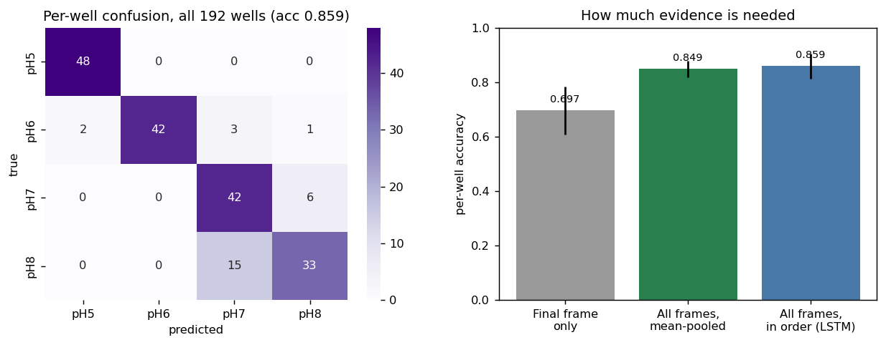

# LSTM / Sequence Models

Every other arm classifies **one image**. This one classifies a **well**: all of
its timepoints, in order, as a single sample.

**Notebook:** `lstm_sequence_model.ipynb`

```
raw images
  -> preprocessing/preprocessing.ipynb   (well detection, crop, well-wise split)
  -> THIS FOLDER                         (frozen ResNet18 per frame -> LSTM -> pH)
```

The motivation comes from `unsupervised/`: colour tracks degradation time about
3.7× more strongly than pH. A single photograph is ambiguous — the same hue can
mean pH 6 early in degradation or pH 7 late — so how a well's colour *changes*
carries information no single frame does.

> **Results here are per WELL and are not comparable with the other folders.**
> One sample *is* one well, so there is no image-level number: the model consumes
> an ordered sequence and emits a single pH. Predicting a well from 11
> photographs is an easier task than predicting one photograph, and the effective
> sample size is 192 rather than 2,091.

## Pipeline

**1. Encode every frame once.** The encoder is frozen, so embeddings are computed
once and cached rather than recomputed each epoch.

```
resize 224x224 -> ImageNet normalise -> ResNet18 (frozen, fc dropped) -> 512-d
```

No colour jitter is applied: colour is the signal being measured.

**2. Build one variable-length sequence per well.** Frames are ordered by elapsed
hours. Not every well has all 11 crops available, so sequences run 8–11 frames
(mean 10.9, and 174 of 192 wells complete) and are masked with
`pack_padded_sequence`; every well is kept. Labels are
`pH - 5`, giving classes 0–3.

**3. Model.**

```
(L, 512) frozen embeddings, L in 6..11
  -> pack_padded_sequence            (masks missing timepoints)
  -> LSTM(512 -> 256)                final VALID hidden state
  -> Dropout(0.5) -> Linear(256, 4)
  -> pH in {5, 6, 7, 8}
```

AdamW `lr=1e-3`, `weight_decay=1e-3`, label smoothing 0.05, batch 16, early
stopping on a validation split held out from the training wells.

The encoder stays frozen, so gradients touch ~800k parameters rather than 11M.

**No elapsed-time feature** — frames are only *ordered*, which is what makes this
a sequence model rather than a bag of images.

## Results



**Left** — per-well confusion across all 192 wells. **Right** — how much evidence
a decision needs: one frame, all frames pooled, or all frames in order.


Grouped 5-fold CV over all 192 wells, per well:

| | per well |
|---|---|
| ResNet18(frozen) + LSTM | **0.859 ± 0.046** |
| acid vs alkaline | **0.979 ± 0.025** |

The acid/alkaline figure is the strongest in the project — nearly every well
lands in the correct clinical band, which is the distinction that matters given
healthy skin sits at pH 4–6 and chronic wounds at pH 7–8.

### Train / validation / test

Training once on the fixed 116-well train split, early-stopping on the 40
validation wells. The notebook prints the table and plots the curves. The
train→validation gap is far narrower here than in the Random Forest arms (+0.24
to +0.26), because dropout 0.5 and weight decay on a small head over frozen
embeddings keep the fit controlled. The headline figure quoted above is the
5-fold CV result, which uses all 192 wells.

### Ablation — does the sequence earn its keep?

Three levels of evidence, separating the value of *having many frames* from the
value of *their order*:

| Evidence used | per-well accuracy |
|---|---|
| Final timepoint only | 0.697 ± 0.088 |
| All frames, order discarded (mean-pooled) | 0.849 ± 0.031 |
| **All frames, in order (LSTM)** | **0.859 ± 0.046** |

Aggregating the trajectory is worth **+0.15** over the last frame alone — a
large, unambiguous gain. Ordering the frames adds a further +0.010, which sits
inside the fold spread, so most of the value here is in aggregation rather than
recurrence.

That also explains why these numbers are not comparable with the image-level
arms: each decision draws on many views rather than one.

## Running

```bash
# open in Jupyter and Run All, or execute headlessly:
jupyter nbconvert --to notebook --execute --inplace lstm/lstm_sequence_model.ipynb
```

Paths inside the notebook are relative to the **repository root**, so start
Jupyter there (or `os.chdir("..")` in the first cell). `Preprocessed_Data/` and
`preprocessing/splits.csv` must be present. Frame embeddings are cached to
`lstm/_embeddings.npz` on the first run, which makes later runs fast.
