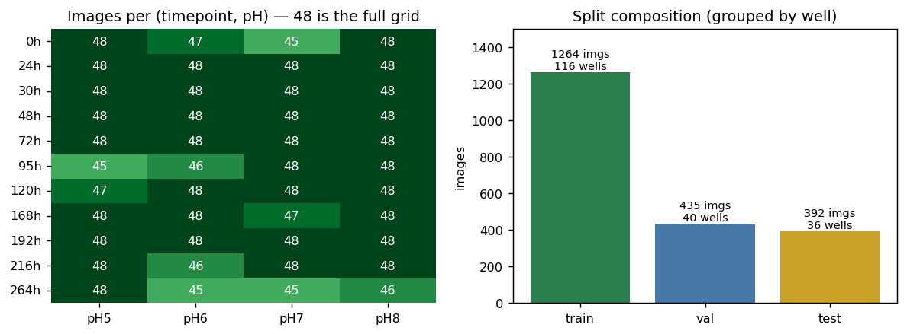

# Preprocessing

Stage 1. Turns raw well-plate photographs into circular single-well crops, then
defines the train/test split every model uses.

Everything in `supervised/`, `unsupervised/`, `transfer_learning/` and `lstm/`
starts from the outputs of this stage.

**Notebook:** `preprocessing.ipynb`

## Dataset

pH-sensitive fluorescent silk fibroin hydrogel dressings imaged in well plates.

| Property | Value |
|---|---|
| Classes | pH 5, 6, 7, 8 |
| Wells | 48 per pH → **192 physical wells** |
| Timepoints | 0, 24, 30, 48, 72, 95, 120, 168, 192, 216, 264 hr (11) |
| Condition | Hydrolytic |
| Raw images | 2,112 = 11 × 4 × 48 (complete factorial grid) |

```
New MLPR Data/<time> hr/pH<n> Hydrolytic/<time>hr_pH<n>_W<well>.JPG
```

**A W-number alone does not identify a well.** W-numbers restart at 1 for each
pH, so `W13` names four different physical gels. The physical well is the
`(pH, well)` pair. This is the unit the split groups by.

## Well detection and circular crop

Isolates the hydrogel well from each photograph so the model sees gel colour
rather than plate background, labels or lighting.

1. `cv2.imread` → `cvtColor(BGR2HSV)`
2. `cv2.inRange(hsv, lower_green, upper_green)` → green mask
3. `GaussianBlur(mask, (5,5), 0)`
4. Morphological `MORPH_CLOSE` then `MORPH_OPEN`, 7×7 kernel — closes pinholes
   inside the well, then removes speckle outside it
5. `findContours(..., RETR_EXTERNAL, CHAIN_APPROX_SIMPLE)`
6. Keep contours with `area ≥ 5000`, `radius > 30` and `circularity > 0.6`,
   where

   ```
   (x, y), radius = cv2.minEnclosingCircle(cnt)
   circularity    = 4 * pi * area / (arcLength^2 + 1e-5)
   ```

   and take the largest survivor
7. Fill a circle mask at `(x, y, r)`, `bitwise_and` it with the image, crop to
   the bounding box
8. Write `Preprocessed_Data/.../cropped_<original>.JPG`

Gel colour shifts with both pH and degradation time, so a single HSV range does
not fit the whole dataset. Five ranges are held in `GREEN_RANGES` and tried in
order until one yields a valid well.

### Coverage

| | |
|---|---|
| Raw images | 2,112 |
| Cropped | **2,091** |
| Not recovered | 21 (1.0%) |

Detection runs in two stages. The green ranges above handle most images; where
they fail a **saturation fallback** takes over, which raises coverage from 92.9%
to **99.0%**.

### Saturation fallback

The green ranges assume the gel is green, which does not hold everywhere: at
0 hr a bright reflection band cuts across the well and drops its contour
circularity below threshold, and at the late timepoints the gel is a pale
olive-grey matching no green range.

In both cases the well is still a bright, well-defined disc in the **saturation**
channel, because the plate background is unsaturated (grey or white) while the
well interior is not. The fallback is:

```
saturation channel -> Gaussian blur -> Otsu threshold
  -> morphological close/open (9x9)
  -> largest contour -> CONVEX HULL      (fills the notch a reflection carves)
  -> minEnclosingCircle
  -> reject if hull fills <72% of its circle, or radius outside 0.18-0.62 of the frame
  -> prefer wells fully inside the frame (neighbouring wells are clipped by the edge)
```

The plate geometry is fixed, so the detected **centre** is combined with the
dataset's standard radius (475 px, the median of the green detector's crops).
Recovered crops then match the existing ones geometrically — median height 950 px
against 951 for the originals.

This recovers 128 of the 149 previously-missed images. The 21 that remain are
spread thinly across timepoints.

## Colour descriptors

The features the models consume, computed in `supervised/supervised_models.ipynb`:

- **Joint HSV histogram** — `calcHist` over all three channels at once with
  8 bins each (512 bins), L2-normalised. A joint 3D histogram keeps
  hue–saturation–value co-occurrence, which three separate 1D histograms would
  discard. 241 bins are identically zero across the dataset and are dropped by a
  variance filter, leaving 169 live features.
- **Colour moments** — per-channel mean and standard deviation of RGB and HSV,
  ignoring the black circular-mask corners (12 values).

pH is encoded almost entirely in the gel's hue and brightness, so colour
descriptors carry most of the usable signal at a fraction of raw-pixel
dimensionality.

## The split

Each well is photographed at 11 timepoints, so those 11 images are
near-duplicates of one another. The split therefore groups by the physical
`(pH, well)` pair: every image of a well lands on the same side, and the
evaluation measures generalisation to unseen gels.

The 192 wells are shuffled with `random.seed(42)`, stratified by pH, and split
60/20/20. The result is written to `preprocessing/splits.csv`:

| | train | val | test |
|---|---|---|---|
| **wells** | 116 | 40 | 36 |
| images | 1,264 | 435 | 392 |
| pH 5 / 6 / 7 / 8 | 318/314/315/317 | 109/109/107/110 | 97/97/99/99 |

The notebook asserts that no well appears in more than one split.

## Evaluation protocol

Models are scored with `StratifiedGroupKFold(5)` grouped by physical well, so
each of the 192 wells is used as test data exactly once — a tighter estimate
(±0.02) than a single 36-well holdout (±0.13). The 60/20/20 columns above provide
a fixed holdout for the train/validation gap reported in `supervised/`.

All accuracies across the project are **per image**: one photograph in, one pH
out.

## Output

| Path | Consumed by |
|---|---|
| `Preprocessed_Data/` | all model folders |
| `preprocessing/splits.csv` | all model folders |

## Results



**Left** — images per (timepoint, pH) cell against the full grid of 48. After the
saturation fallback, 34 of 44 cells are complete and none falls below 45.
**Right** — the split, grouped by physical well.

| | value |
|---|---|
| Raw images | 2,112 |
| Cropped | **2,091 (99.0%)** |
| Physical wells | 192 |
| Complete 11-frame wells | 174 / 192 |
| Split (wells) | 116 train / 40 val / 36 test |
| Split (images) | 1,264 / 435 / 392 |
| Wells shared between splits | **0** |

## Running

```bash
# open in Jupyter and Run All, or execute headlessly:
jupyter nbconvert --to notebook --execute --inplace preprocessing/preprocessing.ipynb
```

Paths inside the notebook are relative to the **repository root**, so start
Jupyter there (or `os.chdir("..")` in the first cell). The image directories are
`.gitignore`d and must be present locally. Set `RUN_FULL_CROP = True` to
regenerate `Preprocessed_Data/` from the raw images.
