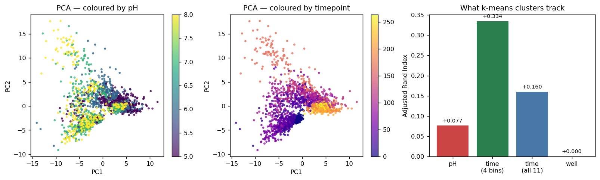

# Unsupervised

Where the other arms ask *"which pH is this?"*, this arm asks *"what structure
does the data have, before any labels are imposed on it?"*

**Notebook:** `unsupervised_analysis.ipynb`

```
raw images
  -> preprocessing/preprocessing.ipynb   (well detection, crop)
  -> supervised/supervised_models.ipynb  (colour histograms, cached)
  -> THIS FOLDER                         (PCA / k-means / GMM / DBSCAN)
```

It tests an assumption the supervised arms rely on — that pH 5, 6, 7 and 8 form
four separable groups in colour space — and it answers the question the labelled
models cannot: **do clusters track pH, or do they track degradation time?**

## Method

Input is the 512-dim joint HSV histogram cached by
`supervised/supervised_models.ipynb`. 241 bins are identically zero, so a
variance filter reduces the space to **169 live features**, which are then
standardised and projected by PCA before clustering.

Labels are never given to any clustering algorithm — they are used only
afterwards, to score what the clusters found. Scoring uses adjusted Rand index
(ARI) and normalised mutual information (NMI) against three candidate groupings:
pH, degradation timepoint, and physical well. Whichever the clusters follow is
the answer.

## Results



**Left and centre** — the same PCA projection coloured by pH and by timepoint.
The timepoint panel shows clear banding; the pH panel does not. **Right** —
adjusted Rand index between k-means clusters and each candidate grouping:
degradation time scores 4.3× higher than pH.


### PCA — colour variance is high-dimensional

| | |
|---|---|
| PC1 | 10.3% |
| PC2 | 7.4% |
| PC1 + PC2 | **17.7%** |
| PCs for 90% variance | **94** of 169 |

There is no dominant axis. A 2D scatter shows less than a fifth of the variance,
so any visual claim of clean separation from such a plot would be an artefact.
Needing 94 components for 90% of the variance is consistent with the supervised
models overfitting in this many dimensions on ~1,200 samples.

The notebook plots the same projection three times — coloured by pH, by
timepoint and by well. The timepoint panel shows visible banding; the pH panel
does not.

### What the clusters track

k-means, k=4, on the 94-component PCA space:

| Grouping | ARI | NMI |
|---|---|---|
| **pH** | +0.077 | 0.089 |
| **Degradation time** (4 bins) | **+0.334** | **0.409** |
| Degradation time (all 11) | +0.160 | 0.359 |
| Physical well | +0.000 | 0.043 |

**Clusters track degradation time roughly 4.3× more strongly than pH.** The
result reproduces across algorithms:

| Algorithm (k=4) | ARI vs pH | ARI vs time |
|---|---|---|
| k-means | +0.077 | **+0.334** |
| Gaussian Mixture | +0.073 | **+0.349** |
| Agglomerative (ward) | +0.070 | **+0.352** |

The near-zero ARI against *well* identity (+0.000) is reassuring: images do not
cluster by which individual gel they came from, so the crops are not encoding
per-well artefacts such as plate position or lighting.

### How many groups are there?

| k | 2 | 3 | **4** | 5 | 6 | **7** | 8 | 9 | 10 |
|---|---|---|---|---|---|---|---|---|---|
| silhouette | 0.113 | 0.120 | 0.128 | 0.126 | 0.105 | **0.129** | 0.116 | 0.118 | 0.120 |

Silhouette peaks at k=7, with k=4 essentially tied — but **every value is low**.
Anything below ~0.25 indicates no substantial cluster structure: the data is
closer to one continuous manifold than to four discrete blobs. That is chemically
sensible, since pH is a continuum and the gel response is gradual.

DBSCAN agrees: at `eps` set to the 90th percentile of the 5-NN distance it finds
a single cluster with 7.0% of points as noise. Finding one cluster is itself the
result — there are no density-separated groups.

### Where pH structure does exist

k-means cluster membership by true pH:

| | c0 | c1 | c2 | c3 |
|---|---|---|---|---|
| **pH5** | **342** | 43 | 0 | 107 |
| **pH6** | **270** | 88 | 6 | 139 |
| **pH7** | 117 | **221** | 40 | 93 |
| **pH8** | 133 | **240** | 48 | 76 |

The structure that is present is **acidic vs alkaline**, not four-way. pH 5 and 6
concentrate in c0; pH 7 and 8 concentrate in c1. This mirrors the supervised
confusion matrices, where errors concentrate between adjacent pH pairs and rarely
cross the boundary.

## What this means for the rest of the project

1. **It sets expectations.** With ARI 0.08 between colour clusters and pH, no
   model should be expected to reach very high per-image 4-way accuracy from
   colour alone. The supervised ceiling around 0.75–0.81 is consistent with the
   structure genuinely present in the features.
2. **It argues for sequence models.** If time dominates single-image colour, then
   modelling how a specific well's colour evolves is the principled response.
   See `lstm/`.
3. **It reframes the target.** A binary acidic/alkaline formulation matches both
   the cluster structure and the clinical question — healthy skin pH 4–6, chronic
   wound pH 7–8 — far better than 4-way classification, and every arm scores
   0.93–0.99 on it.

## Running

```bash
# open in Jupyter and Run All, or execute headlessly:
jupyter nbconvert --to notebook --execute --inplace unsupervised/unsupervised_analysis.ipynb
```

Paths inside the notebook are relative to the **repository root**, so start
Jupyter there (or `os.chdir("..")` in the first cell). Requires
`supervised/_features.npz` (produced by `supervised/supervised_models.ipynb`)
and `preprocessing/splits.csv`.
